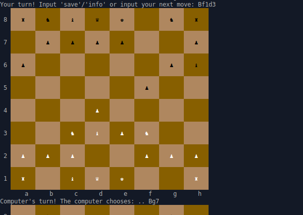

# Chess

## Project info

A command line Chess game where two players can play against each other. The purpose of this project is to show that I can take on a project with a lot of different components. This is the capstone project of [The Odin Project's Ruby course](https://www.theodinproject.com/paths/full-stack-ruby-on-rails/courses/ruby).

Project description can be found [here](https://www.theodinproject.com/lessons/ruby-ruby-final-project).

## Game info

- Use [Standard Algebraic Notation](https://en.wikipedia.org/wiki/Algebraic_notation_(chess)) to select your moves.
- Type 'save' at any point to save your game.
- Type 'info' at any point for game information or instructions.

## Live demo

Live demo available [on Replit (account required)](https://replit.com/@jcampbell57/Chess#main.rb)

## Table of Contents

* [Features](#features)
* [Technologies utilized](#technologies-utilized)
* [Learning outcomes](#learning-outcomes)
* [Project screenshot](#project-screenshot)
* [Behind the Scenes](#behind-the-scenes)
* [Installation](#installation)

## Features

- Play multiplayer or singleplayer against the computer.
- Save and resume your games.
- Validation of player and computer moves.
- A stylish brown chess board.

## Technologies utilized

- Ruby
- RSpec
- YAML

## Learning outcomes

This project helped to reinforce the following skills:

- Test Driven Development (TDD)
- Object Oriented Programming (OOP)
- implementation of game saves through serialization
- basic Ruby knowledge

## Project screenshot

## Behind the scenes

### Project notes

- I tried to reduce save file size by having each piece create an adjacency list each time update_children is called, but that slowed the game down significantly

### Improvements

This project could be improved with:

- a more sophisticated computer AI 
- a turn output like the one in [this example](https://andrewjh271.github.io/chess/)
- each move should be recorded to a game history
  - undo move should pull from game history instead of undo any piece's previous move.
  - feature to 'replay game' and go through move by move or let it autoplay the whole game.
- Binary search implemented where appropriate

### Resources

- Run `rspec` to run tests
- The larger display was inspired by [this example](https://andrewjh271.github.io/chess/)

## Installation

- Clone this repository to your desktop.
- Navigate to the top level of the directory by running `cd ruby_chess`.
- Run `ruby main.rb` in your terminal.
